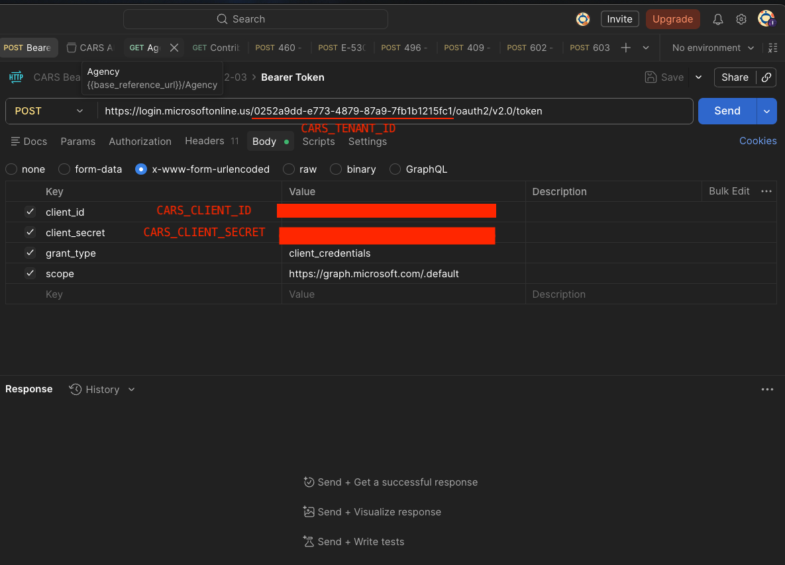

# cars-cli

A command-line tool for submitting CARS (Cal-Access Replacement System) filings against the California Secretary of State's **certification environment**. Built for ISP developers integrating CARS into their production app.

You get three commands packaged in a single Docker image:

| Command | What it does |
|---|---|
| `cars_check` | Validate your JSON payload against our schema, submit it to cert, poll for the result — all in one shot. The main thing you'll run. |
| `cars_auth` | Print a bearer token. Useful for ad-hoc requests with `curl` or Postman. |
| `cars_status` | Look up (or poll) the status of a submission you already made. |

No Ruby, no Node, no Linux setup needed. You install Docker once, pull this image, and run a command.

---

## 60-second quickstart

You need:
1. **Docker Desktop** installed and running ([download for Windows](https://www.docker.com/products/docker-desktop/))
2. **Your CARS credentials** — a tenant ID, client ID, and client secret from your CARS-team contact (Azure AD app registration)

Then, from a PowerShell prompt:

```powershell
# 1. Pull the image (~1.1 GB, one-time)
docker pull ghcr.io/tilthouse/cars_update/cars-cli:latest

# 2. Save credentials to a file your machine can find
New-Item -ItemType Directory -Force -Path "$env:USERPROFILE\.config\cars-api" | Out-Null
@"
CARS_TENANT_ID=<your-tenant>
CARS_CLIENT_ID=<your-client-id>
CARS_CLIENT_SECRET=<your-secret>
"@ | Set-Content "$env:USERPROFILE\.config\cars-api\credentials.env"
# (Edit the file to plug in real values — see "Where credentials come from" below)

# 3. Submit a payload — replace 460, your_payload.json, and the filer ID
cd "$env:USERPROFILE\Documents"   # or wherever your payload JSON lives
docker run --rm `
  -v "${env:USERPROFILE}\.config\cars-api:/root/.config/cars-api:ro" `
  -v "${PWD}:/work" `
  ghcr.io/tilthouse/cars_update/cars-cli:latest `
  /app/bin/cars_check 460 /work/your_payload.json --filer YOUR_FILER_ID
```

You'll get back a single JSON object on stdout. The top-level `outcome` field is a single string telling you what happened; the `stages` object breaks it down per pipeline stage so you can see exactly where it stopped (or that everything passed):

```json
{
  "form": "460",
  "outcome": "Accepted",
  "stages": {
    "schema_validation":  { "outcome": "LocalSchemaValid",     "ok": true,  ... },
    "auth":               { "outcome": "AuthOK",               "ok": true },
    "initial_validation": { "outcome": "InitialValidationOK",  "ok": true,  ... },
    "processing":         { "outcome": "Accepted",             "ok": true,  ... }
  }
}
```

Possible top-level outcomes: `Accepted`, `LocalSchemaValid` (only with `--validate-only`), `LocalSchemaInvalid`, `ConfigError`, `AuthFailed`, `RejectedAtInitialValidation`, `RejectedForBusinessRuleViolation`, `SystemError`, `Stuck`. Failing stages include `error` (one-line summary), `kind` (machine-readable type), and `remedy` (an actionable hint).

Every run also writes a complete record of the submission to disk at `./cars_check_runs/cars_check_<form>_<timestamp>.json` — relative to whatever directory you ran the `docker run` command in. The file contains the full request and response for every CARS HTTP call, every status poll, and per-stage timing, regardless of what you saw on stdout. After each run you'll see a one-line stderr message telling you where the file went; inside Docker, a second line translates the in-container path to where the file lives on your host. Pass `--no-output-file` to suppress.

When a submission rejects and you want everything on stdout too, add `-v` (or `--verbose`):

```powershell
docker run --rm `
  -v "${env:USERPROFILE}\.config\cars-api:/root/.config/cars-api:ro" `
  -v "${PWD}:/work" `
  ghcr.io/tilthouse/cars_update/cars-cli:latest `
  /app/bin/cars_check 460 /work/your_payload.json --filer YOUR_FILER_ID -v
```

That single flag adds the raw HTTP request + response for the CARS submit and the final status poll, every poll's history, the (redacted) Azure AD token exchange, per-stage timing, and a `[cars_check]` progress stream on stderr — convenient when you want to pipe straight into `jq`. The full guide inside the image (see below) documents granular flags for each of those if you want only one slice.

---

## Where credentials come from

Your CARS-team contact provides three values. If they gave you a Postman collection, all three live inside the **Bearer Token** request in the **CARS Bearer Token** collection — open that request and click the **Body** tab. The tenant ID is the UUID embedded in the token URL at the top; the client ID and client secret are entries in the `x-www-form-urlencoded` body:



Paste these three values into the `credentials.env` file created in step 2 of the quickstart.

---

## Full integration guide

The complete guide — Docker install walkthrough, credential setup explained, every flag explained, PowerShell alias recipe, troubleshooting, WSL 2 fallback path — is **inside the image**:

```powershell
# Print to terminal
docker run --rm ghcr.io/tilthouse/cars_update/cars-cli:latest cat /app/README.md

# Or save it to your current directory and open in your editor
docker run --rm -v "${PWD}:/work" `
  ghcr.io/tilthouse/cars_update/cars-cli:latest `
  cp /app/README.md /work/CARS_INTEGRATION_FOR_ISP_DEVS.md
notepad CARS_INTEGRATION_FOR_ISP_DEVS.md
```

On macOS / Linux, the equivalents are:

```bash
docker run --rm ghcr.io/tilthouse/cars_update/cars-cli:latest cat /app/README.md | less
```

The in-image guide always matches the version of the toolkit you pulled. Updating is `docker pull` and you're done.

---

## What this is not

- **Not for production submissions.** This targets the CARS *certification* environment for testing your integration against the real validator. The cert env doesn't create real filings.
- **Not a library.** Don't link against it; it's a runnable CLI. The implementation language (Ruby) is an implementation detail.
- **Not a CARS account.** You need credentials from your CARS-team contact before any of this works.

---

## Source

The toolkit's implementation lives in a private repository. If you have access, the canonical source is at `tilthouse/cars_update`. This public repo (`tilthouse/cars-cli`) exists to host this landing-page README so the GitHub Container Registry page for the image has somewhere to render docs from.

Image: `ghcr.io/tilthouse/cars_update/cars-cli`
Built from: a Dockerfile that bundles Ubuntu 24.04 + Ruby + the CARS client toolkit.
Published: automatically on every push to the source repo's `main` branch.
